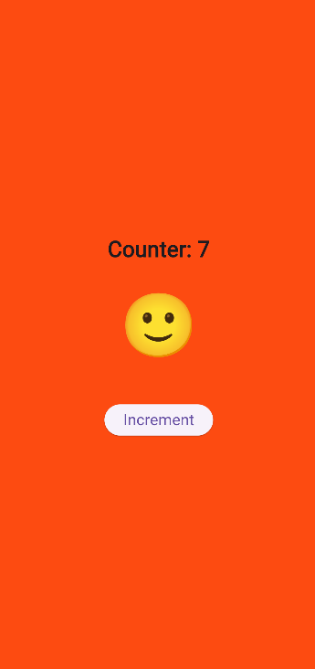

# counter_app

This creative counter app updates the emoji according to the value, increases the counter, and randomly changes the background color using setState() to instantly refresh the user interface.  For clarity, this project is divided into several files, and each button click demonstrates how Flutter recreates the interface in an easy and entertaining.

##  Screenshots

| Screenshot 1 | Screenshot 2 |
|--------------|--------------|
|  |  |

| Screenshot 3 | Screenshot 4 |
|--------------|--------------|
|  |  |

| Screenshot 5 | — |
|--------------|---|
|  | |

---

## Getting Started

This project is a starting point for a Flutter application.

A few resources to get you started if this is your first Flutter project:

- [Lab: Write your first Flutter app](https://docs.flutter.dev/get-started/codelab)
- [Cookbook: Useful Flutter samples](https://docs.flutter.dev/cookbook)

For help getting started with Flutter development, view the
[online documentation](https://docs.flutter.dev/), which offers tutorials,
samples, guidance on mobile development, and a full API reference.
